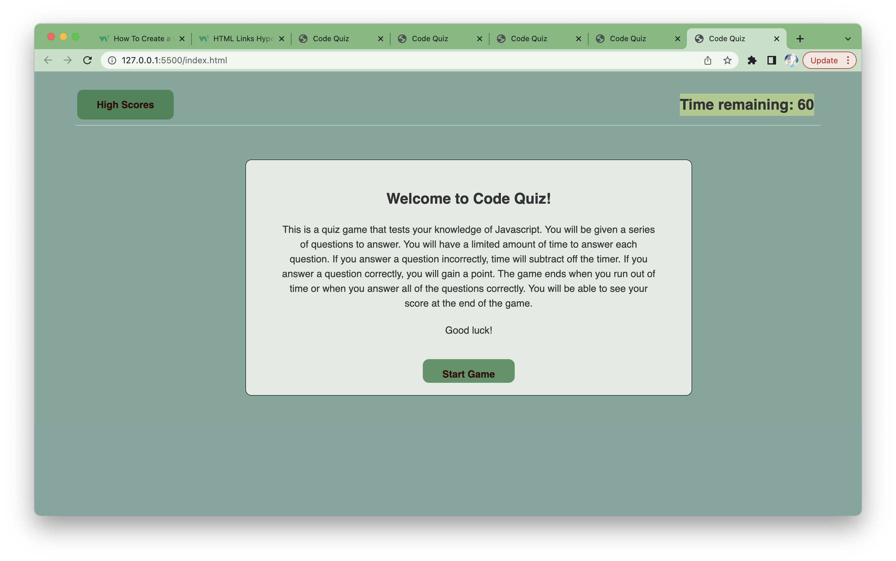
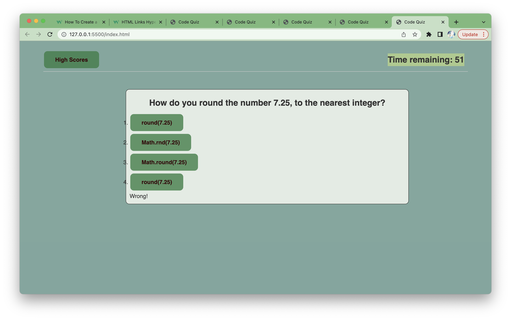

# Code Quiz

## Description
This application is a timed quiz themed around javascript questions to enhance your knowledge and terminology as a coder.

## Table of Contents
* [Installation](#installation)
* [Usage](#usage)
* [License](#license)
* [Questions](#questions)

## Installation
Navigate to the [deployed application](https://katerynatekmenzhi.github.io/code-quiz/) to start the game!

## Usage
When you first open the application, a welcome modal will greet you with a start game button. Press start to begin answering questions. When you answer correct, you get a point. When you answer wrong, time is subtracted off the timer. When 60 secs is over, your scores will display and you will get to choose to either save your score, go back, or restart the game.

The following image showcases the welcome modal of the game 

The following image showcases the game in action. A wrong answer was just selected, so the timer subtracted and the gamer was notified of the wrong answer down below

## License

---
### Questions
The URL of the deployed [application](https://katerynatekmenzhi.github.io/code-quiz/)

[Email](Kateryna.koltunova@gmail.com)

Github Username
[KaterynaTekmenzhi](https://github.com/KaterynaTekmenzhi)
